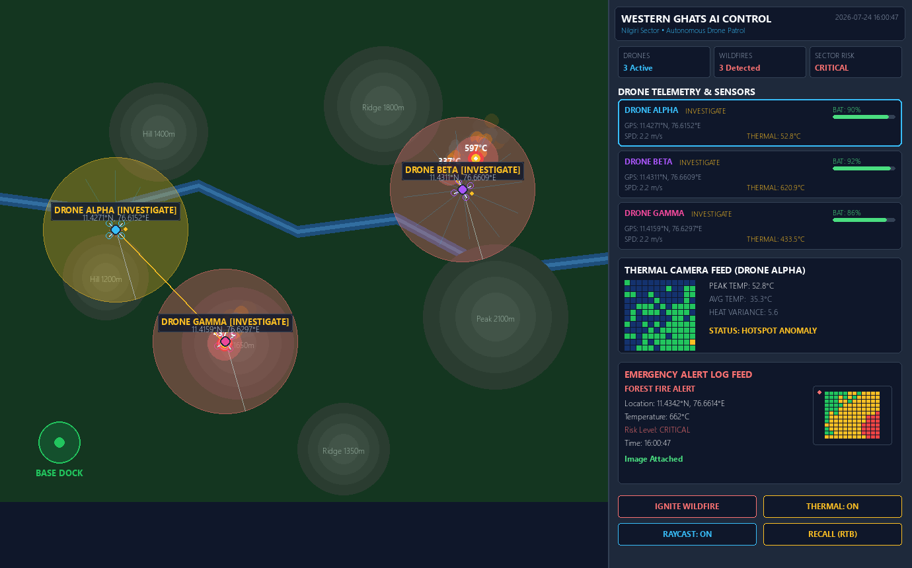
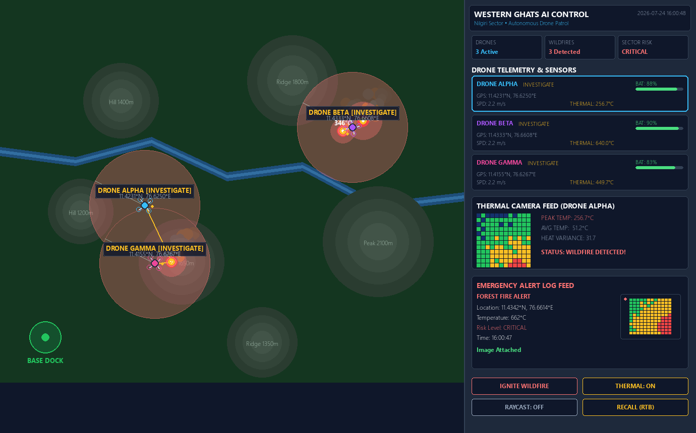
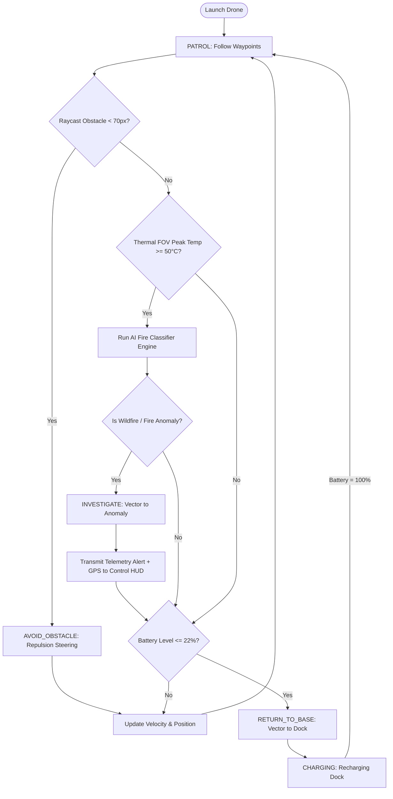

# Technical AI Autonomous Forest Fire Detection System (Western Ghats Sector)

[](https://www.python.org/)
[](https://www.pygame.org/)
[](LICENSE)

An autonomous, multi-agent AI simulation modeling airborne forest fire detection, obstacle avoidance, thermal sensor matrix sampling, and real-time telemetry alert transmission in the ecologically sensitive **Western Ghats region (Nilgiris / Wayanad sector)**.

---

## 📸 Simulation Preview & Screenshots

| Autonomous Patrol & Telemetry HUD | Thermal Detection Mode |
| :---: | :---: |
|  |  |

---

## 🏗️ System Architecture

The system follows a modular, decoupled architecture consisting of **Forest Environment Physics**, **Autonomous Drone Agents (FSM + Sensor Payloads)**, **AI Classification Engine**, and a **Control Station Dashboard HUD**.

```mermaid
graph TD
    subgraph Western Ghats Environment
        A1[Forest Canopy Grid] --> A2[Thermal Temperature Field]
        A3[Hill Elevation Obstacles] --> A4[Dynamic Wildfire Propagation]
        A5[River Streams]
    end

    subgraph Autonomous Drone Agent Payload
        B1[Raycast Distance Sensors] --> B2[Vector Steering Engine]
        B3[Thermal Imaging Camera] --> B4[AI Fire Classifier]
        B5[Battery & RTB Manager] --> B6[Finite State Machine]
    end

    subgraph AI Classification Engine
        C1[Peak Temp & Heat Variance] --> C2[Spatial Gradient Analysis]
        C2 --> C3{AI Confidence >= 75%}
        C3 -->|Yes| C4[CONFIRMED_WILDFIRE]
        C3 -->|No| C5[SUN_BAKED_ROCK / Normal]
    end

    subgraph Ground Control Station HUD
        D1[Real-Time Map Viewport]
        D2[Drone Telemetry Cards]
        D3[Thermal Heat Matrix Widget]
        D4[Emergency Alert Console]
    end

    Western Ghats Environment --> Autonomous Drone Agent Payload
    Autonomous Drone Agent Payload --> AI Classification Engine
    AI Classification Engine --> Ground Control Station HUD
```

---

## 🔄 Autonomous AI Agent Workflow

Each drone executes a continuous 60 FPS decision cycle governed by an AI Finite State Machine:



---

## 🌟 Key Features & Technical Details

1. **Western Ghats Topography & Real GPS Mapping**:
   - Accurately converts 2D map pixel coordinates $(x, y)$ to real-world Western Ghats geographical coordinates:
     - **Latitude**: $11.4000^\circ\text{ N} \rightarrow 11.4500^\circ\text{ N}$
     - **Longitude**: $76.6000^\circ\text{ E} \rightarrow 76.6800^\circ\text{ E}$
   - Simulates Nilgiri mountain elevation ridges (acting as physical flight obstacles) and river streams (Kabini/Periyar representations).

2. **Multi-Agent Physics & Raycast Obstacle Avoidance**:
   - Vector steering using potential field forces: target attraction towards waypoints combined with distance-weighted raycast repulsion away from hills/trees.
   - 12-ray directional obstacle sensor array with danger zone collision thresholds.

3. **Thermal Imaging & AI Fire Classification Engine**:
   - Airborne thermal scanner with circular FOV cone ($110\text{px}$ radius).
   - Samples a $12 \times 12$ matrix heat intensity grid beneath the drone.
   - AI Decision Formula evaluates peak temperature, spatial heat variance ($\sigma$), and temporal persistence:
     $$\text{Confidence} = 0.65 \times \left(\frac{T_{\text{peak}} - 50}{280 - 50}\right) + 0.35 \times \left(\frac{\sigma_{\text{temp}}}{45}\right)$$
   - Classifies scan targets into `NORMAL`, `SUN_BAKED_ROCK` (false positive filter), `POTENTIAL_FIRE`, or `CONFIRMED_WILDFIRE`.

4. **Dynamic Battery Management & Autonomous RTB**:
   - Depletes battery proportionally to flight speed and sensor load.
   - When battery drops below $22\%$, the drone autonomously aborts its current mission, enters `RETURN_TO_BASE` state, navigates to the Ground Docking Station, recharges to $100\%$, and resumes patrol.

5. **Ground Control Station HUD**:
   - **Main Map Viewport**: Displays elevation topo, water streams, drone quadcopters, waypoint lines, thermal FOV frustums, and alert pins.
   - **Telemetry Side Panel**:
     - System stats (Active Drones, Wildfire Count, Sector Risk Level).
     - Live Drone Telemetry cards (Battery progress bar, Speed, GPS, State).
     - Live $12 \times 12$ Thermal Camera Matrix feed widget.
     - Real-time emergency alert feed with timestamps and GPS coordinates.
     - Interactive control buttons (`IGNITE WILDFIRE`, `TOGGLE THERMAL`, `TOGGLE RAYCAST`, `RECALL ALL`).

---

## 📁 Project Structure

```
ai/
├── main.py                     # Entry point & main simulation loop
├── config.py                   # Global constants, physics, colors, GPS bounds
├── requirements.txt             # Dependencies (pygame, numpy, matplotlib, pillow)
├── README.md                    # System documentation and architecture diagrams
├── models/
│   ├── __init__.py
│   ├── drone.py                 # Drone physics, FSM state machine, vector steering & RTB
│   ├── environment.py           # Western Ghats terrain, heat matrix, river & fire propagation
│   └── sensors.py               # Thermal camera, Raycast sensors & AI Fire Classifier
├── ui/
│   ├── __init__.py
│   ├── dashboard.py             # Control station HUD, telemetry cards & alert log feed
│   └── renderer.py              # 2D map renderer, thermal FOV shader & particle engine
├── utils/
│   ├── __init__.py
│   ├── geo.py                   # Pixel to Western Ghats GPS coordinate converter
│   └── capture_screenshots.py   # Utility script to export documentation screenshots
└── docs/
    └── assets/                  # Generated simulation screenshots
```

---

## 🚀 Quick Start & Installation

### Prerequisites
- Python 3.10 or higher installed.

### 1. Clone & Navigate to Project Directory
```bash
cd ai
```

### 2. Install Dependencies
```bash
pip install -r requirements.txt
```

### 3. Run the Simulation
```bash
python main.py
```

### 4. Interactive Controls
- **Left Mouse Click (on Map)**: Ignite a wildfire at clicked location.
- **`SPACE`**: Ignite a wildfire at a random location.
- **`T`**: Toggle thermal FOV overlay.
- **`R`**: Toggle raycast obstacle sensor lines.
- **`B`**: Order all drones to Return to Base (RTB).
- **Dashboard Buttons**: Click any button on the right control panel.

### 5. Generate Screenshots for Reports
```bash
python utils/capture_screenshots.py
```

---

## 📄 License
This project is open-source under the MIT License - suitable for academic demonstrations, university assignments, and AI agent research.
