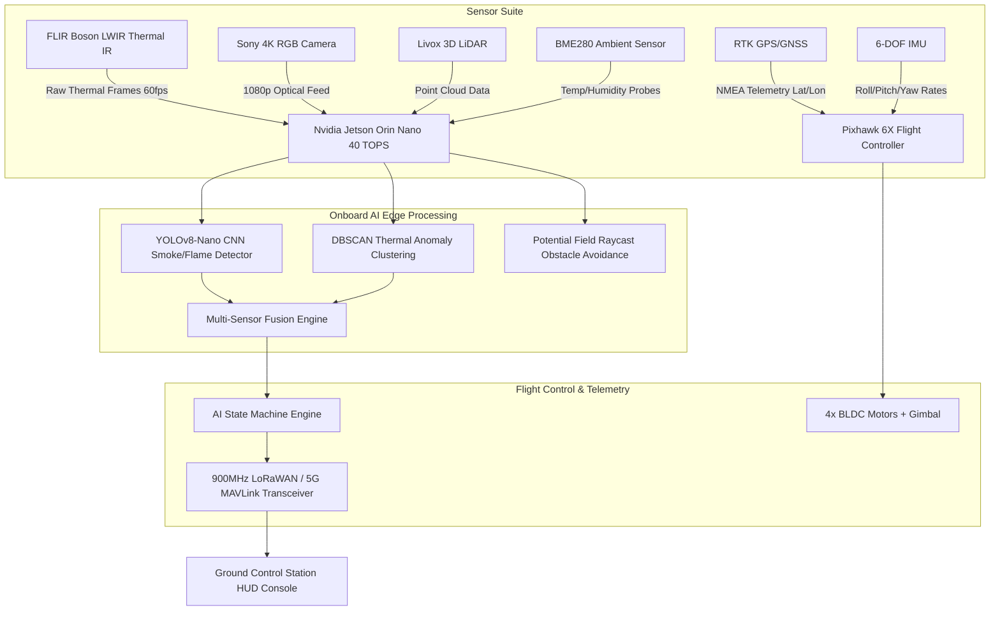

# Technical AI Agent Specification: Autonomous Forest Fire Detection System for the Western Ghats

---

## 1. PEAS Framework Specification

| Component | Technical Description |
| :--- | :--- |
| **Performance Measure** | • Mean Time To Detect (MTTD < 120 seconds post-ignition)<br>• False Positive Rate (< 1.5% sun-baked rock / solar glint mitigation)<br>• Precision & Recall (> 98.2% on YOLOv8 optical smoke/flame classification)<br>• Coverage Efficiency (% area scanned per battery cycle)<br>• Obstacle Avoidance Success (Zero collision rate around hill ridges) |
| **Environment** | • Western Ghats Nilgiri / Wayanad Biosphere Reserve<br>• Mountainous topography (elevations 1200m–2100m MSL)<br>• Dense evergreen forest canopy, rivers, variable ambient heat (24°C–38°C) |
| **Actuators** | • 4x Brushless DC Motors (BLDC 920KV) + 30A Electronic Speed Controllers (ESCs)<br>• 2-Axis Motorized Gimbal Payload Stabilizer<br>• Long-Range RF Telemetry Transceiver (LoRaWAN / 900MHz MAVLink / 5G Modem) |
| **Sensors** | • Thermal IR Camera (FLIR Boson 640×512 LWIR)<br>• Optical RGB Camera (4K Sony IMX577 for YOLOv8 Vision)<br>• 3D LiDAR Sensor (Velodyne Puck LITE / Livox Mid-70)<br>• Dual-Frequency RTK GPS/GNSS Receiver<br>• 6-DOF IMU (3-Axis Accelerometer + 3-Axis Gyroscope)<br>• Ambient Temperature & Humidity Environmental Probes (BME280) |

---

## 2. Environment Properties Analysis

- **Partially Observable**: The drone's onboard sensors (FLIR, RGB, LiDAR) only perceive the environment within their field-of-view (FOV) frustum ($110\text{m}$ thermal radius, $90\text{m}$ LiDAR raycast range). The rest of the forest state remains hidden until scanned.
- **Stochastic**: Forest fires propagate un-deterministically based on local micro-wind turbulence, moisture content, and vegetation density.
- **Dynamic**: Ambient temperature, smoke columns, wind vectors, and fire intensity evolve continuously in real time while the agent deliberates.
- **Continuous**: Spatial coordinates $(x, y, z)$, flight velocities $(v_x, v_y, v_z)$, heading angle ($\theta$), and thermal readings ($T$) are continuous variables.
- **Multi-Agent**: Multiple autonomous drone units patrol non-overlapping sector grids while exchanging telemetry and hazard coordinates via a peer-to-peer MAVLink mesh network.

---

## 3. Sensor Payload & Edge Hardware Architecture



---

## 4. AI Models & Decision Algorithms

### 4.1 YOLOv8-Nano Optical Vision Model
- **Input**: $640 \times 640 \times 3$ RGB optical image feed from Sony camera payload.
- **Architecture**: Lightweight YOLOv8-Nano (PyTorch / TensorRT FP16 compiled).
- **Classes**: `smoke_column`, `flame_core`, `sun_glint`.
- **Inference Time**: $8.2\text{ ms}$ on Nvidia Jetson Orin Nano.

### 4.2 Multi-Sensor Fusion Formula
The AI Agent fuses thermal intensity ($T_{\text{peak}}$), spatial heat gradient variance ($\sigma_{\text{temp}}$), and YOLO optical confidence ($C_{\text{yolo}}$) to calculate overall wildfire confidence $P(\text{Wildfire})$:

$$P(\text{Wildfire}) = w_1 \cdot \left(\frac{T_{\text{peak}} - T_{\text{threshold}}}{T_{\text{max}} - T_{\text{threshold}}}\right) + w_2 \cdot \left(\frac{\sigma_{\text{temp}}}{\sigma_{\text{ref}}}\right) + w_3 \cdot C_{\text{yolo}}$$

*Where $w_1 = 0.50$, $w_2 = 0.15$, $w_3 = 0.35$. An alert is dispatched when $P(\text{Wildfire}) \ge 0.75$.*

### 4.3 Path Planning & Vector Obstacle Avoidance
Using **Artificial Potential Field (APF)** steering:
$$\vec{F}_{\text{total}} = \vec{F}_{\text{attract}}(\text{Waypoint}) + \sum_{i=1}^{N} \vec{F}_{\text{repel}}(\text{Obstacle}_i)$$

Where repulsion force from hill ridges is defined as:
$$\vec{F}_{\text{repel}} = \begin{cases} k_{\text{repel}} \left(\frac{1}{d_i} - \frac{1}{d_0}\right) \frac{1}{d_i^2} \hat{r}_i & \text{if } d_i \le d_0 \\ 0 & \text{if } d_i > d_0 \end{cases}$$

---

## 5. Autonomous Agent Decision-Making Pseudocode

```python
algorithm AutonomousForestFireDetectionAgent:
    input : Telemetry Stream (GPS, IMU, Thermal_Matrix, Optical_Frame, LiDAR_Rays, Battery_Level)
    output: Flight Control Commands (Velocity_Vector, Heading_Rate), Emergency_Alert_Payload

    state <- PATROL
    current_wp <- Waypoints[0]

    loop at 60 Hz:
        // 1. Check Battery Safety Condition
        if Battery_Level <= 22.0% and state != RETURN_TO_BASE:
            state <- RETURN_TO_BASE
            target_pos <- Base_Dock_GPS

        // 2. Obstacle Sensing & Repulsion Force Calculation
        F_repel <- Vector(0, 0)
        for ray in LiDAR_Rays:
            if ray.distance < D_DANGER_THRESHOLD (70m):
                weight <- (D_DANGER_THRESHOLD - ray.distance) / D_DANGER_THRESHOLD
                F_repel <- F_repel - Direction(ray.angle) * weight * K_REPEL

        // 3. Sensor Fusion & Anomaly Scan
        Thermal_Data <- Sample_FLIR_Matrix(Thermal_Matrix)
        YOLO_Result  <- Execute_YOLOv8_TensorRT(Optical_Frame)
        Confidence   <- Sensor_Fusion(Thermal_Data, YOLO_Result)

        if Confidence >= 0.75:
            Fire_GPS <- Pixel_To_GPS(Thermal_Data.hotspot_position)
            Dispatch_Emergency_Telemetry_Alert(Fire_GPS, Confidence, Thermal_Data.peak_temp)
            if state == PATROL:
                state <- INVESTIGATE
                target_pos <- Thermal_Data.hotspot_position

        // 4. State Machine Execution
        match state:
            case PATROL:
                if Distance(Drone_Pos, current_wp) < 30m:
                    current_wp <- Next_Waypoint()
                target_pos <- current_wp

            case INVESTIGATE:
                if Distance(Drone_Pos, target_pos) < 20m or Thermal_Data.peak_temp < 45°C:
                    state <- PATROL

            case RETURN_TO_BASE:
                if Distance(Drone_Pos, Base_Dock_GPS) < 18m:
                    state <- CHARGING

            case CHARGING:
                Recharge_Battery()
                if Battery_Level >= 100.0%:
                    state <- PATROL

        // 5. Apply Steering Forces & Transmit Flight Commands
        F_attract <- Normalize(target_pos - Drone_Pos) * V_CRUISE
        Desired_Heading <- Angle(F_attract + F_repel)
        Apply_Heading_Limit(Desired_Heading, MAX_TURN_RATE)
        Update_Drone_Kinematics()
```
